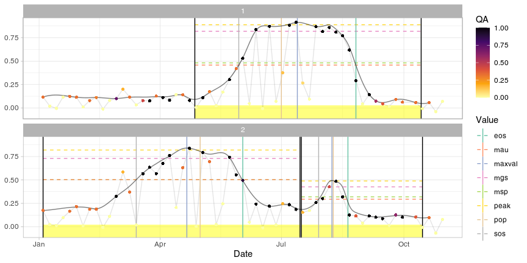

<!-- IMPORTANT: do NOT edit README.Rmd! Edit index.Rmd instead, -->

<!-- and generate README.Rmd using utils/code/create_README.sh  -->

[](https://doi.org/10.5281/zenodo.4682829)
[](http://www.gnu.org/licenses/gpl-3.0)
[](blob/master/.github/CODE-OF-CONDUCT.md)

# Build and Analyse Sentinel-2 Time Series


`{sen2rts}` is an R library which helps to extract and manage time
series from Sentinel-2 archives created with the package `{sen2r}`.

This package is currently under development (beta version).

Functionalities currently implemented in the package are summarised
below. A wider overview is presented in the vignette [“The sen2rts
workflows”](https://sen2rts.ranghetti.info/articles/workflow.html),
which shows a simple, reproducible use case to obtain a smoothed
equally-weighted time series, isolate cycles and extract metrics,
explaining how the currently implemented functions can be used to
perform a common workflow. For documentation about specific functions,
see the [Reference](./reference) page.

## Installation

Currently `{sen2rts}` is not on CRAN; it can be installed from GitHub:

``` r
install.packages("remotes")
remotes::install_github("ranghetti/sen2rts")
```

In case of troubles related to the installation of `{sen2r}`, whose
`{sen2rts}` depends, refer to [sen2r installation
page](https://sen2r.ranghetti.info/articles/installation.html).

## Usage

The following minimal example synthetically shows how to perform the
main steps provided by the package; refer to [this
vignette](https://sen2rts.ranghetti.info/articles/workflow.html) for a
wider explanation.

``` r
library(sen2rts)

## Create a Sentinel-2 derived archive using sen2r
#  (see sen2r documentation at https://sen2r.ranghetti.info/ )
#  and read the paths of the raster using function load_s2paths()
#
#  (in this examples, sample data are used)
sen2r_ndvi_paths <- sample_paths("NDVI") # NDVI images (target product)
sen2r_scl_paths <- sample_paths("SCL")   # SCL images (quality flag)

## Extract, smooth and gap fill time series
data("sampleroi") # Sample spatial features for data extraction
ts_raw <- extract_s2ts(sen2r_ndvi_paths, sampleroi, scl_paths = sen2r_scl_paths)
# extract time series over sampleroi extension
ts_smoothed <- smooth_s2ts(ts_raw) # smooth time series
ts_filled <- fill_s2ts(ts_smoothed) # gap filling (daily time series)

## Phenological fitting and extraction
dt_cycles <- cut_cycles(ts_filled) # cut vegetation cycles
cf <- fit_curve(ts_filled, dt_cycles) # fit double logistic curves
dt_pheno <- extract_pheno(cf) # extract phenological metrics

## Plot results
plot(ts_filled, pheno = dt_pheno, plot_points = TRUE)
```



## Credits

<a href="http://www.irea.cnr.it" target="_blank"></a>

`{sen2rts}` is being developed by Luigi Ranghetti
([IREA-CNR](http://www.irea.cnr.it)), and it is released under the [GNU
General Public License version
3](https://www.gnu.org/licenses/gpl-3.0.html) (GPL‑3).

The [sen2rts
logo](https://github.com/ranghetti/sen2rts/raw/master/man/figures/sen2rts_logo_250px.png),
partially derived from the [R logo](https://www.r-project.org/logo), is
released under the [Creative Commons Attribution-ShareAlike 4.0
International license](https://creativecommons.org/licenses/by-sa/4.0)
(CC-BY-SA 4.0).

To cite this library, please use the entry reported below.

L. Ranghetti (2021). **“sen2rts: Build and Analyse Sentinel-2 Time
Series”**. R package version 0.4.0. doi:
<a href="https://doi.org/10.5281/zenodo.4682829" target="_blank">`10.5281/zenodo.4682829`</a>,
URL:
<a href="https://sen2rts.ranghetti.info" target="_blank">`https://sen2rts.ranghetti.info`</a>.

``` bibtex
@Manual{sen2rts_manual,
  author = {Luigi Ranghetti},
  title = {sen2rts: Build and Analyse Sentinel-2 Time Series},
  year = {2021},
  doi = {10.5281/zenodo.4682829},
  url = {https://sen2rts.ranghetti.info},
  note = {R package version 0.4.0},
}
```

## Contributing

This project is released with a [Contributor Code of
Conduct](blob/master/.github/CODE-OF-CONDUCT.md). By participating in
this project you agree to abide by its terms.
